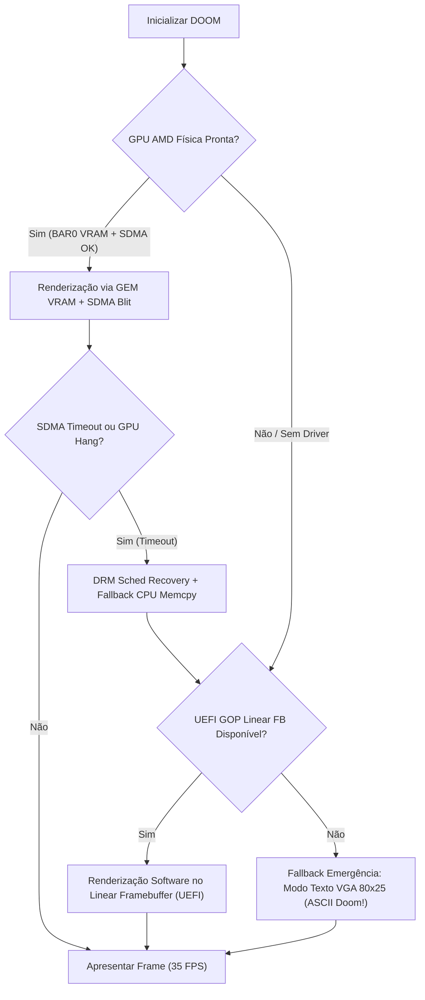

# ApolloOS: Milestone "It Runs DOOM" (GPU Hardware & Fallback Validation)

> *"Se um sistema operacional consegue inicializar o driver de vídeo, alocar VRAM e submeter comandos à GPU, o teste supremo de validação não é um benchmark sintético... é rodar DOOM."*

---

## 1. Visão Geral e Objetivo

Este documento estabelece o marco oficial de validação e fallback gráfico do ApolloOS: **executar o clássico DOOM (1993) renderizado e acelerado através da GPU (AMD Radeon / AMDGPU e VGPU)**.

Mais do que uma homenagem clássica da computação, rodar DOOM no ApolloOS serve a três propósitos arquiteturais críticos:

1. **Validação Prática do Pipeline DRM/KMS**: Exercitar a alocação de memória de vídeo (GEM / VRAM BAR0), buffers lineares, double-buffering e page flips atômicos.
2. **Teste de Estresse de DMA & Ring Buffers (SDMA)**: Validar submissão assíncrona de cópias de buffer (blit 2D) da RAM de sistema para a VRAM física via engine SDMA do hardware AMD (Polaris / GFX8 / Ellesmere).
3. **Aplicação de Fallback Gráfico**: Garantir que o sistema possui um fallback visual robusto e funcional caso os modos de vídeo avançados ou compositores complexos falhem.

---

## 2. Arquitetura de Execução

### 2.1 Engine Base: `doomgeneric`
Para evitar dependência de libc complexa e permitir execução tanto em kernel-mode (demo embutida de boot) quanto em userland no futuro, adotaremos o **`doomgeneric`**.
O `doomgeneric` abstrai todo o I/O em apenas 5 funções fundamentais:

| Callback | Papel no ApolloOS | Subsistema Integrado |
| :--- | :--- | :--- |
| `DG_Init()` | Inicialização da sessão gráfica e alocação de buffers | DRM / GEM (`drm_gem_create`, `drm_gem_vram_pin`) |
| `DG_DrawFrame()` | Apresentação do frame na tela (320x200) | Blit SDMA / VRAM Scanout / DRM Atomic Commit |
| `DG_SleepMs(uint32_t ms)` | Espera de tempo e controle de framerate | Scheduler / Timer Preemptivo (`pit_sleep_ms`) |
| `DG_GetTicksMs()` | Leitura de timestamp em milissegundos | APIC / PIT Timer (`timer_get_ticks()`) |
| `DG_GetKey(int *pressed, unsigned char *key)` | Leitura de eventos de teclado | Driver de Teclado PS/2 / Interrupção IRQ 1 |

### 2.2 Carregamento de Assets (`DOOM1.WAD`)
- O arquivo shareware oficial **`DOOM1.WAD`** (~4.1 MB) será disponibilizado via:
  - **Módulo Multiboot2 (Initrd)**: Carregado pelo GRUB/bootloader na memória física durante o boot.
  - **Ponteiro de Memória Direto**: O kernel recebe o endereço do módulo nas tags Multiboot2 e o expõe como um arquivo de leitura somente em memória (`/boot/doom1.wad`).

---

## 3. Pipeline Gráfico com AMDGPU & VRAM

### Nível 1: GEM Dumb Buffer em VRAM Física (`BAR0`)
- **Resolução Nativa**: 320x200 (original) ou 640x400 / 1280x800 escalado.
- **Formato de Cor**: Doom renderiza em paleta 8-bit indexada; um shader ou tabela rápida converte para `XRGB8888` / `ARGB8888`.
- **Mapeamento**:
  - Buffer alocado diretamente no espaço mapeável da VRAM (`BAR0 = 0xd0000000` na Radeon RX 590).
  - Escrita direta da CPU ou cópia acelerada.

### Nível 2: Aceleração 2D com SDMA (System DMA Engine)
Em vez de depender da CPU para copiar ~1 MB por frame através do barramento PCIe para a VRAM:
1. O frame é renderizado no buffer em RAM de sistema (GTT / System RAM).
2. O driver emite um pacote de cópia no **SDMA Ring Buffer** (`SDMA_OP_COPY`).
3. A GPU copia os dados em altíssima velocidade para a VRAM de scanout.
4. Uma `dma_fence` sinaliza a conclusão do blit, garantindo sincronização sem travar o processador.

### Nível 3: Double Buffering & VBLANK Sincronizado
- Dois buffers de vídeo (`Front Buffer` e `Back Buffer`).
- Alternância de ponteiros de scanout via chamada atômica ou registro de CRTC (`amdgpu_crtc_page_flip`).
- Trava nos 35 FPS nativos do motor do Doom ou sincronização a 60/75 Hz sem tearing (*screen tearing*).

---

## 4. Matriz de Fallback em Caso de Falha de Vídeo

O teste com DOOM também valida a robustez do pipeline de degradação graciosa do ApolloOS:

1. **Fallback Nível 1 (SDMA Timeout / Hang)**: Se o ring buffer do SDMA sofrer timeout, o `drm_sched` cancela o job, recupera o ring e faz o blit via CPU `memcpy` na VRAM sem derrubar o jogo.
2. **Fallback Nível 2 (DCE / KMS Indisponível)**: Se a controladora de display dedicada (DCE 11.2) não detectar monitor conectado ou falhar no modeset, o buffer é redirecionado para o Framebuffer linear fornecido pelo UEFI GOP.
3. **Fallback Nível 3 (Falha Crítica de VRAM/GPU)**: O ApolloOS comuta imediatamente para o console de texto de emergência com dump detalhado dos registradores (`GRBM_STATUS`, `SRBM_STATUS`, `CP_RB_RPTR`).

---

## 5. Roadmap de Implementação do Marco

- [ ] **Fase 1: Infraestrutura de Memória & Mapeamento**
  - Mapear BAR0 (VRAM 256MB) e BAR5 (MMIO 256KB) sem conflitos no hardware real Polaris (`0x6FDF`).
  - Alocador simples de blocos contíguos na VRAM para Framebuffer.
- [ ] **Fase 2: Port do `doomgeneric`**
  - Importar o core do `doomgeneric` para `kernel/demos/doom/` ou subsistema de testes.
  - Implementar o conversor de paleta 8-bit para ARGB8888.
  - Conectar callbacks de clock (`DG_GetTicksMs`) e teclado (`DG_GetKey`).
- [ ] **Fase 3: Loop Gráfico e Apresentação**
  - Renderizar os primeiros frames estáticos da tela de abertura do DOOM no framebuffer UEFI GOP.
  - Integrar com o scanout buffer da VRAM física.
- [ ] **Fase 4: Aceleração SDMA Ring**
  - Implementar submissão de pacote SDMA para cópia assíncrona de buffer.
  - Medir framerate e validar estabilidade térmica da GPU (sem disparar ventoinhas a 100%).

---

## 6. Conclusão

Ter o DOOM rodando diretamente sobre o driver AMDGPU no ApolloOS será o divisor de águas entre um sistema com stubs teóricos e um sistema operacional com um pipeline gráfico real, responsivo e operacional.
